Practica servidor web
1. Titulo
Creación y manipulación básica de archivos y directorios en Linux (GitBash)

2. Tiempo de duración
Tiempo utilizado: 60 minutos

3. Fundamentos:
Los sistemas operativos basados en Linux nos dan una interfaz de línea de comandos que permite al usuario, osea nosotros, ejecutar programas, manipular archivos y automatizar tareas mediante scripts. El shell más común es bash; GitBash en Windows ofrece un entorno similar que admite la mayoría de comandos básicos de Linux(el cual es el que vamos a usar para esta practica): ls, cd, mkdir, cp, mv, rm, cat, redirecciones (>, >>) y tuberías (|).

El sistema de archivos en Linux se organiza en directorios y archivos; los permisos y rutas relativas/absolutas son conceptos claves. La redirección permite enviar la salida de un comando a un archivo (por ejemplo, > sobrescribe lo que queremos poner y >> en cambio añade mas contenido). Las tuberías (|) permiten encadenar comandos, pasando la salida de uno como entrada del siguiente; por ejemplo, history | tail -n 50 muestra las últimas 50 entradas del historial.

Poder comprender cómo crear, copiar, mover y eliminar archivos es esencial para la gestión de proyectos y la preparación de entregables como informes o archivos. El uso de editores de terminal (nano, vim) o redirecciones y heredoc facilita la creación rápida de archivos desde la terminal.

En esta práctica trabajare además con Git: inicializar un repositorio local (git init), crear commits y conectar con un repositorio remoto en GitHub para subir los archivos. Es importante saber cómo autenticarte (usuario+contraseña o token personal) y cómo gestionar ramas (main).

Adicionalmente, la práctica solicita un archivo de audio en formato .mp3. Para usuarios en Windows(como yo) lo mas facil y práctico es usar la aplicación Grabadora de voz del sistema; si se dispone de ffmpeg, se puede convertir o recortar audio desde la línea de comandos.

Esta sera la estructura de directorios para poder trabajar esta practica:
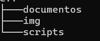
Figura 1-1. Estructura de carpetas del proyecto.

Comandos basicos de linux para gestionar documentos y archivos.
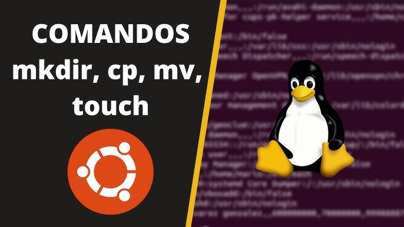
Figura 1-2. Comandos basicos.

4. Conocimientos previos.
Para realizar esta práctica se recomienda:

-Conocer los comandos básicos de Linux: ls, cd, mkdir, cp, mv, rm, cat.
-Saber crear archivos con redirecciones.
-Conceptos básicos de Git y GitHub.
-Conocimientos elementales sobre herramientas para grabar.

5. Objetivos a alcanzar
-Crear una estructura de carpetas organizada para un proyecto.
-Manipular archivos usando copia, renombrado, movimiento, redirección,etc.
-Registrar el historial de comandos en un archivo para entrega.
-Preparar el presente informe en Markdown y subirlo, junto con el archivo de comandos y un audio .mp3, a un repositorio en GitHub.

6. Equipo necesario:
-Computador con Windows (GitBash) / Linux (WSL o terminal) / Mac.
-Conexión a Internet para subir repositorio a GitHub.
-Cuenta en GitHub.
-App grabadora de voz para generar el MP3.

7. Material de apoyo.
-Guia de asignatura.
-Hojas de trucos (cheat sheet) de Linux.
-Video guia de la tarea asignada.

8. Procedimiento
-Paso 1: En tu directorio de trabajo, crea una carpeta llamada proyecto_comandos.
Dentro de proyecto_comandos, crea tres subcarpetas: documentos, imagenes y scripts.
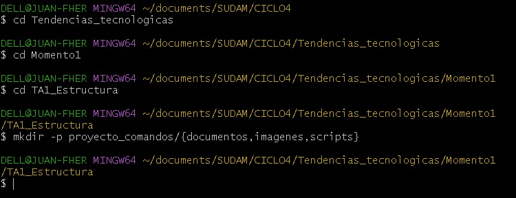
Figura 1-3. Comandos basicos.

-Paso 2: Dentro de la carpeta documentos, crea un archivo de texto llamado notas.txt.
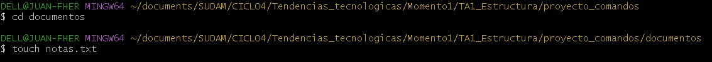
Figura 1-4. Comandos basicos.

-Paso 3: Agrega al menos tres líneas de texto en notas.txt utilizando un editor de texto en la terminal (nano, vim) o con redireccionamiento (echo).
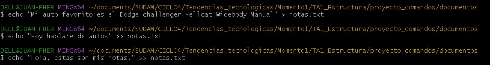
Figura 1-5. Comandos basicos.

-Paso 4: Copia el archivo notas.txt a la carpeta scripts y cambia su nombre a backup_notas.txt.
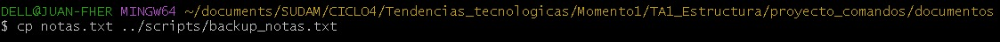
Figura 1-6. Comandos basicos.

-Paso 5: Mueve el archivo backup_notas.txt a la carpeta imágenes.
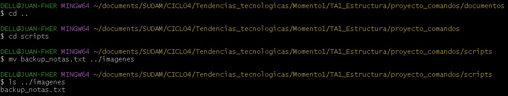
Figura 1-7. Comandos basicos.

-Paso 6: Crea un archivo llamado resumen.txt en documentos, redirecciona el contenido de notas.txt a resumen.txt.
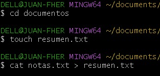
Figura 1-8. Comandos basicos.

-Paso 7: Añade una nueva línea de texto a resumen.txt sin sobrescribir su contenido.
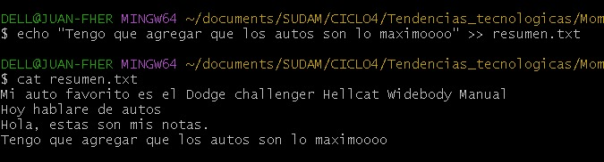
Figura 1-9. Comandos basicos.

-Paso 8: Elimina el archivo backup_notas.txt de la carpeta imágenes.
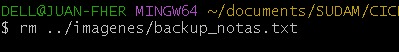
Figura 1-10. Comandos basicos.

-Paso 9: Elimina la carpeta imágenes (solo si está vacía).
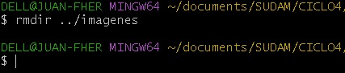
Figura 1-11. Comandos basicos.

9. Resultados esperados:
Al finalizar la práctica logramos terminar las siguientes actividades:

-Crear la estructura de carpetas (proyecto_comandos con las subcarpetas documentos, imagenes y scripts).
-Generar y editar notas.txt dentro de la carpeta documentos.
-Copiar, renombrar y mover archivos entre las diferentes carpetas creadas.
-Aplicar redirecciones para enviar y añadir contenido a otros archivos.
-Eliminar archivos y carpetas de manera controlada utilizando los comandos de Linux.
-Guardar el historial de comandos en un archivo de texto.
-Al finalizar las carpetas deben quedar asi:
-Paso 9: Elimina la carpeta imágenes (solo si está vacía).
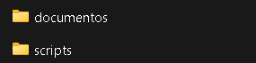
Figura 1-12. Comandos basicos.

Estos resultados muestran el dominio básico de la manipulación de archivos y directorios en Linux usando la terminal.

10. Bibliografía
Shotts, W. E. (2019). The Linux Command Line: A Complete Introduction (2nd ed.). No Starch Press.

Chacon, S., & Straub, B. (2014). Pro Git (2nd ed.). Apress.

Maguaman2. (s.f.). Informe tendencias [Repositorio en GitHub]. GitHub. Recuperado el 4 de octubre de 2025, de https://github.com/maguaman2/informe-tendencias